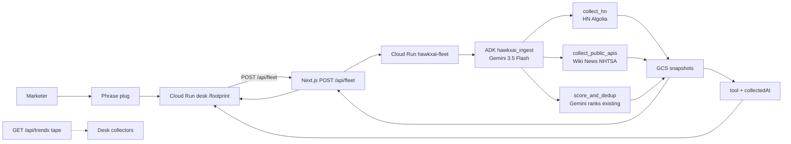

# HawkxAI

Live footprint desk for a campaign name you already own. Plug a phrase on `/footprint`. See where it printed, which hashtags, QRs, and URLs rode along, and a mind map from those receipts. Evidence only. Never an invented WHY.

`/` is the trending tape. `/footprint` is the campaign war-room. Brandwatch answers “what is trending globally.” HawkxAI answers “where did *our* phrase land.”

Hosted: [Footprint on Cloud Run](https://hawkxai-qalms3xvxq-uc.a.run.app/footprint) · repo: https://github.com/kishanraj41/hawkxai

Built during All Things Agentic (opened **4 August 2026**): Next.js desk, Google ADK ingest fleet on Cloud Run, GCS snapshots, and the architecture diagram.

## Architecture

Poster: [`public/demo/architecture.html`](public/demo/architecture.html) · desk route `/architecture` in the running app

**Gemini 3.5 Flash** · **Google ADK** (`hawkxai_ingest`) · **Cloud Run** × 2 (desk + fleet) · **Cloud Storage**. Each receipt keeps `tool` + `collectedAt`. `GET /api/trends` stays the tape — the fleet never writes it.



- Desk: https://hawkxai-qalms3xvxq-uc.a.run.app/footprint
- Fleet ADK UI: https://hawkxai-fleet-qalms3xvxq-uc.a.run.app/dev-ui
- Snapshots: `gs://hawkxai-fleet-snapshots/`

Tools are gated by `fleet/permissions.json`. Occupancy HistGB stays host-class L1 until 20 gold inspect tags. X is not the centerpiece.

## Run locally

```bash
git clone https://github.com/kishanraj41/hawkxai.git
cd hawkxai
npm install
cp .env.example .env.local
```

`.env.local` (never commit it):

```
GOOGLE_API_KEY=...
GEMINI_MODEL=gemini-3.5-flash
FLEET_URL=http://localhost:8080
```

Desk:

```bash
npm run dev
```

- http://localhost:3000 — trends
- http://localhost:3000/footprint — plug `{ "phrase": "Camry" }` via `POST /api/fleet`
- http://localhost:3000/demo/architecture.html — contest poster

Fleet:

```bash
cd fleet
python -m venv .venv
.venv\Scripts\activate
pip install -r requirements.txt
copy .env.example .env
uvicorn main:app --reload --port 8080
```

Proof of Action: `POST http://localhost:8080/v1/ingest` with `{"phrase":"Camry"}`, then plug Camry on `/footprint`. ADK logs: http://localhost:8080/dev-ui

First `GET /api/trends` can take ~60–90s. Then it caches five minutes.

## Honest limits

- Reddit may 403. The pill says `reddit offline`; other sources still render.
- X can time out. Clustering still runs on HN and public receipts.
- If evidence is thin, the desk says so. Never invent posts or a WHY.

## Stack

Next.js 14 · React 18 · D3 · Gemini 3.5 Flash · Google ADK · Cloud Run · Cloud Storage · Cloud SQL Postgres

Fleet spin-up detail: [fleet/README.md](fleet/README.md)
