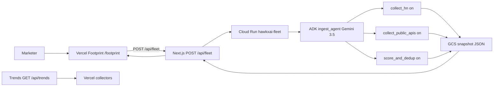

# HawkxAI ingest fleet — architecture

Generated from `fleet/` files and `fleet/permissions.json`. Not an invented diagram.

Lineage (AutoLineage): each receipt keeps `tool` + `collectedAt` from the collect step that produced it. RudriQ is the extraction layer. Visible on the desk as a lineage strip; Save .md includes the table.

## Files

- `fleet/ingest_agent/agent.py` — ADK root_agent
- `fleet/ingest_agent/runner.py` — Runner.run_async then persist
- `fleet/tools/hn_channel.py` — HN Algolia
- `fleet/tools/public_apis.py` — Wikipedia, Google News RSS, NHTSA
- `fleet/tools/score.py` — dedup + Gemini rank of existing titles
- `fleet/tools/snapshot.py` — GCS or local JSON
- `app/api/fleet/route.ts` — desk merge (does not touch GET /api/trends)
